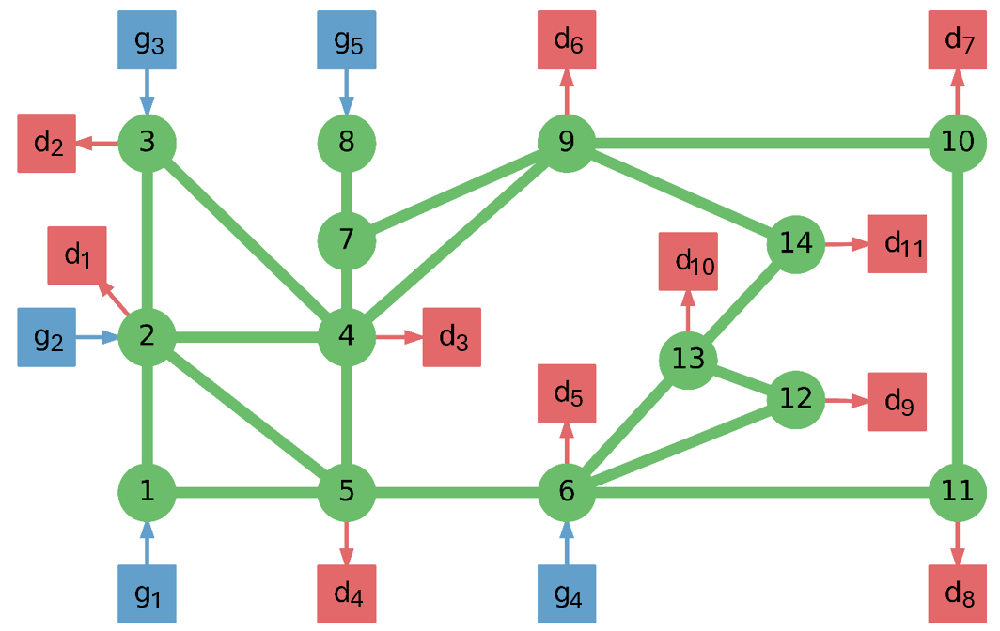
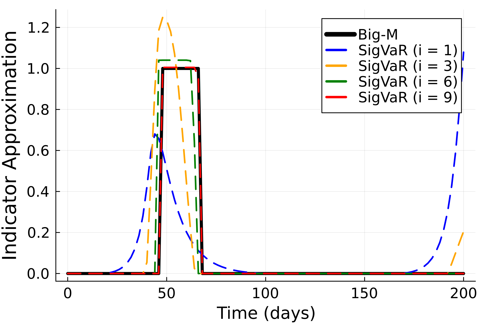
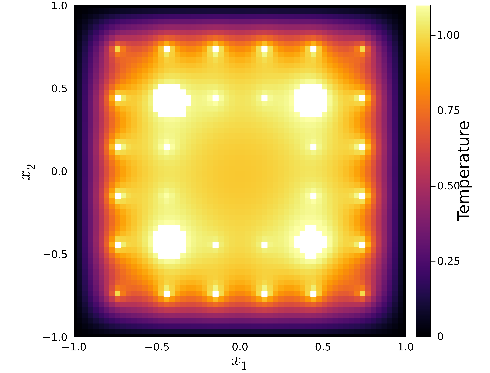

# Event Constrained Programming Case Studies
Here we provide the source code to the results presented in 
"Event Constrained Programming" by 
Daniel Ovalle, Stefan Mazzadi, Carl D. Laird, Ignacio E. Grossmann, and Joshua L. Pulsipher. 

To run the source code below, the master version of InfiniteOpt.jl is required and caan be installed as follows:

```julia
julia> import Pkg

julia> Pkg.add(url = "https://github.com/infiniteopt/InfiniteOpt.jl", rev = "master")
```

## Case Study 1: Power Grid
Here is the source code for the power grid case study that 
features different event constraints. The entirety 
of this case study is self-contained in `Power_Grid/ieee14_infiniteopt.jl`. 



### Running it
To configure the required packages, we recommend creating a Julia environment 
using the included `Project.toml` file. Thus, we can configure the environment and 
run the case study via:
```julia
julia> cd("[INSERT_PATH_TO_FILES]/Power_Grid/")

julia> ]

(@v1.11) pkg> activate .

(Power_Grid) pkg> instantiate

julia> include("ieee14_infiniteopt.jl")
```

## Case Study 2: Pandemic Control
Here is the source code for the pandemic control case study that 
features different event constraints. The entirety 
of this case study is self-contained in `Pandemic_Control/Pandemic_Control_Code_Final_GitHub.jl`. 



### Running it
To configure the required packages, we recommend creating a Julia environment 
using the included `Project.toml` file. Thus, we can configure the environment and 
run the case study via:
```julia
julia> cd("[INSERT_PATH_TO_FILES]/Pandemic_Control/")

julia> ]

(@v1.11) pkg> activate .

(Pandemic_Control) pkg> instantiate

julia> include("Pandemic_Control_Code_Final_GitHub.jl")
```

## Case Study 3: 2D Diffusion
Here is the source code for the 2D diffusion case study that 
features different event constraints. The entirety 
of this case study is self-contained in `2D_Diffusion/2D_Diffusion_Code_final_GitHub.jl`. 



### Running it
To configure the required packages, we recommend creating a Julia environment 
using the included `Project.toml` file. Thus, we can configure the environment and 
run the case study via:
```julia
julia> cd("[INSERT_PATH_TO_FILES]/2D_Diffusion/")

julia> ]

(@v1.11) pkg> activate .

(2D_Diffusion) pkg> instantiate

julia> include("2D_Diffusion_Code_final_GitHub.jl")
```
Note: All .json data files produced will be saved in each case study's respective "data_folder" folder.
