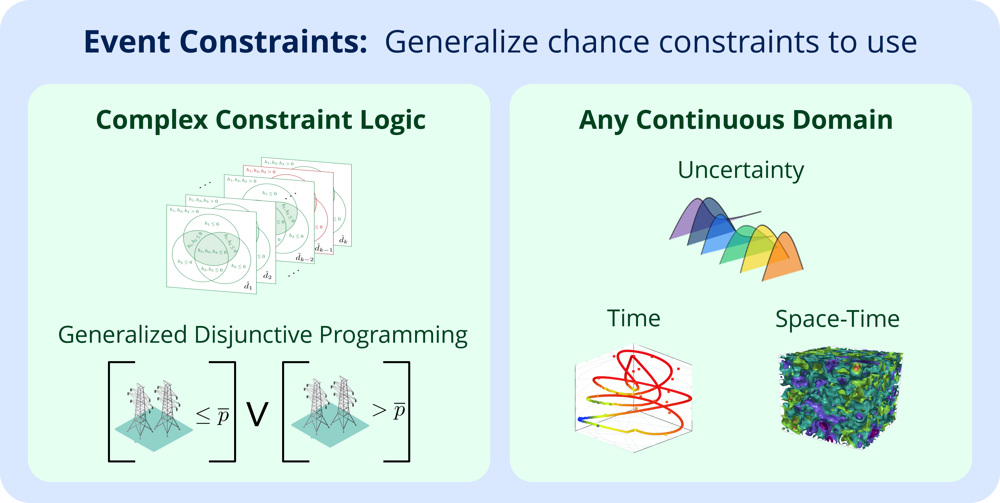

# Event Constrained Programming
## Infinite-Dimensional Optimization Case Studies
This repository contains the source-code Julia scripts used in the case studies 
featured in the manuscript "Event Constrained Programming" by Daniel Ovalle, Stefan Mazzadi, Carl D. Laird, Ignacio E. Grossmann, and Joshua L. Pulsipher.

## Implementation
First, you'll need to install Julia (available at https://julialang.org/downloads/).
Then you'll find instructions about running each case study on the `README.md` 
file within each case study folder.